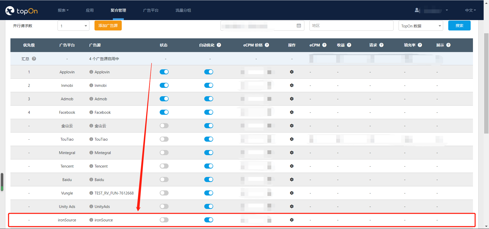

# TopOn SDK 集成测试及FAQ说明

[0. 集成检查列表 CheckList](#0)<br>
[1. TopOn SDK测试指引](#1)<br>
[2. 错误码信息](#2)<br>
[3. FAQ](#3)<br>


<h2 id='0'>0. 集成检查列表 CheckList</h2>

**a、SDK核心依赖包：**
```
anythink_core.aar
```

**b、广告形式依赖包：**
```
原生广告：anythink_native.aar 
横幅广告：anythink_banner.aar
插屏广告：anythink_interstitial.aar 
激励视频：anythink_rewardvideo.aar 
开屏广告：anythink_splash.aar 
```

**c、头部竞价功能依赖包：**（使用头部竞价功能时必须导入）
```
anythink_headbiding.aar
```

**d、广告平台的依赖，network目录下对应广告平台文件夹中的:**
```
libs、extra文件夹中的aar、jar包
AndroidManifest.xml
proguard-android.txt
res资源
```
(比如：聚合Facebook和Admob两家广告平台，则network目录下的facebook、admob文件夹中的所有相关资源均需要导入、配置）

**e、android-v7库依赖：**
```java
dependencies {
    implementation 'com.android.support:appcompat-v7:28.0.0'
}
```

**f、AndroidManifest.xml 9.0高版本适配**

```java
 <application
        ...
        <!--针对Android高版本下可以使用Http请求的配置-->
        android:usesCleartextTraffic="true">
        ....
        <!--针对Android 9.0以上的配置，用于适配9.0的网络请求-->
        <uses-library android:name="org.apache.http.legacy" android:required="false"/>
        ....
<application>
```

**g、SDK 混淆配置**
```java
-dontwarn com.anythink.**
-keep public class com.anythink.network.**
-keepclassmembers class com.anythink.network.** {
   public *;
}
```

<br>

集成如果有问题，请跳转 [Android_TopOn_SDK_集成文档](Android_TopOn_SDK_集成文档.md)


<h2 id='1'>1. TopOn SDK测试指引</h2>

**测试开始前请按照 [集成检查列表](#0) 检查TopOn SDK的依赖包以及您打算聚合的广告平台的依赖是否均导入进工程中，包括aar、jar、AndroidManifest.xml、proguard-android.txt、res资源等。**

<h3>1.1 打开SDK的日志功能</h3>

1. 初始化之前，加上此代码：**ATSDK.setNetworkLogDebug(true)**

2. AndroidStudio中Logcat以**anythink_network**为TAG进行过滤，查看日志

<h3>1.2 广告位配置广告源</h3>

1. 确保TopOn后台中的广告位下有配置广告源，通过**添加广告源**按钮进行添加，并且**状态为开启**


以上图为例，**DemoBlack_RV**这个广告位（id: **b5c4ad2f0de421**)配置了以下广告源：

​	1) **ironSource (此时TopOn SDK将首先请求此广告源)**

​	2) Applovin

​	3) Inmobi

​	4) Admob

​	5) Facebook

**均为开启状态**。

<h3>1.3 发起请求，观察logcat并排查错误</h3>

以**DemoBlack_RV**这个广告位为例，TopOn SDK将首先请求排在第一位的**ironSource**这个广告源，发起广告请求并显示，观察logcat中SDK的输出日志，格式如下：

```java
{
	"placemengId": "b5b449eefcab50", //发起了加载的广告位id
	"adType": "reward", //发起加载的广告位类型
	"action": "request_result", //发起广告加载后的动作：request(广告请求)，request_result(广告返回的结果)，impression（广告展示），click（广告点击），close（广告关闭）
	"refresh": 0,
	"result": "success", //结果参数，success(成功)，fail(失败)
	"position": 0, //当前的AdSource的排序位置
	"networkType": 1,  //表示第三方平台的id信息，可以在GitHub的说明查看对应是哪个第三方平台（https://github.com/uparputeam/uparpu_demo_android）
	"networkUnit": "{\"unit_id\":\"1673989822661578_1846988512028374\"}", //对应第三方广告平台的app和placement信息
	"msg": "", //如果出现加载失败，这里会输出完整的错误信息
	"hourly_frequency": 0, //当前小时展示的次数
	"daily_frequency": 0, //前天展示的次数
	"network_list": "1", //当前第三方广告请求列表的id，以“,”间隔
	"request_network_num": 1 //表示同时发起多少个第三方广告平台的加载
}

```

观察**"result"**字段对应的值

<h4>1.3.1 “success”：成功</h4>

如果**加载、显示、点击、关闭**等全部流程均成功，请跳转 [1.4 验证下一个广告源](#1.4)

<h4>1.3.2 “fail”：失败</h4>

观察**“msg”**字段的输出，或者在回调中通过**AdError.printStackTrace()**获取的完整错误信息说明，格式如下：

```java
"code[ " + code + " ]
,desc[ " + desc + " ]
,platformCode[ " + platformCode + " ]
,platformMSG[ " + platformMSG + " ]"

code：TopOnSDK的内部错误码
desc：TopOnSDK的内部错误描述
platformCode：第三方广告平台的错误码（广告没有填充的时候需要检查的错误码）
platformMsg：第三方广告平台的错误信息（广告没有填充的时候需要检查的错误信息）
```

1. 请先根据**code**进行查询，请跳转 [2. 错误码信息](#2)，查询TopOnSDK的错误码及描述
2. 如果**code==4001**，请根据**platformCode**、**platformMsg**到对应的第三方广告平台查询错误码及描述

<h3 id="1.4">1.4 验证下一个广告源</h3>

1、以**DemoBlack_RV**这个广告位为例，当**ironSource**这个广告源的**加载、展示、点击、关闭**均成功后，说明此广告源以成功接入。

2、然后需要测试排在第二位的**Applovin**这个广告源是否接入成功，可在TopOn后台点击广告源的状态开关，将第一位的**ironSource**这个广告源的状态关闭，像下面这样：



关闭状态的广告源将自动下移。**修改后大约1分钟生效（因为SDK本地会有缓存，所以需要清除应用数据后再试）**，**此时广告位的广告源如下：**

​	1) **Applovin (此时TopOn SDK将首先请求此广告源)**

​	2) Inmobi

​	3) Admob

​	4) Facebook

共有生效的4个广告源存在。

3、**重复执行1.3步骤，关闭验证成功的广告源状态，验证Applovin**

4、**重复执行1.3步骤，关闭验证成功的广告源状态，验证Inmobi**

5、**重复执行1.3步骤，关闭验证成功的广告源状态，验证剩余广告源是否接入成功**

当所有广告源都验证接入成功后，说明此广告位无异常

<h3>1.5 验证下一个广告位</h3>

1、在验证完一个广告位之后，需要验证其他广告位（如果你的应用有多个广告位）。在TopOn后台，可以通过**点击广告位进行广告位的切换**，像下面这样：


2、**重复执行1.2~1.4步骤**，直至应用中所有广告位验证完毕。


<h2 id='2'>2. 错误码信息</h2>

<h4>错误码信息说明</h4>

| 错误码 | 说明                                                         |
| ------ | ------------------------------------------------------------ |
| 9999   | 一般是网络请求出现错误，检查网络状态是否正常                 |
| 9990   | Http接口请求返回的状态错误，需要联系TopOn同事查看错误信息    |
| 9991   | 接口请求返回的业务代码错误，需要联系TopOn同事查看错误信息    |
| 9992   | GDPR的等级设置过低，检查是否手动设置了FORBIDDEN等级          |
| 2001   | 广告加载超时，检查当前的测试的广告源是否是海外平台，手机网络是否已经翻墙 |
| 2002   | TopOn的SDK包导入不全，缺失第三方广告厂商的Adapter包，确认是否已经按照指引导入聚合的第三方需要的SDK包 |
| 2003   | 当前广告位的展示次数已经达到上限，需要确认TopOn的后台配置是否限制了该广告位的展示次数 |
| 2004   | 当前广告位处于非展示时间段，需要确认TopOn的后台配置是否限制了广告位的展示间隔 |
| 2005   | 该广告位处于加载阶段，同一个广告位不能在同一时间发起两次加载 |
| 2006   | 检查导入第三方的SDK包是否齐全，如果齐全则检查导入的版本是否与GitHub上指定的版本是否相符合，否则需要将第三方SDK包补充完整 |
| 3001   | 策略获取错误，先检查网络是否正常，再检查使用appid，appkey，placementid是否匹配 |
| 3002   | 传入的appid,appkey，placementid其中有一个为空字符            |
| 4001   | 广告无填充错误码，可通过AdError.printStackTrace()获取完全的错误信息 |
| 4002   | Context的上下文已经被销毁，需要重新创建相应的广告类型对象再重新发起广告加载 |
| 4003   | 该广告位的状态已经关闭，需要联系TopOn的同事查看广告位的状态  |
| 4004   | 该广告位没有在TopOn后台配置AdSource的信息，需要到TopOn后台的广告位配置生成第三方广告平台的AdSource信息 |


<h2 id='3'>3. FAQ</h2>

**问**：当请求广告时出现的platform的错误码和错误信息，应该怎么查询没有填充的问题？<br>
**答**：如果TopOn的错误码是4001的话，出现platform的错误码需要到对应的第三方平台网站查看错误码信息（可通过日志中networkType字段来查看是哪家第三方广告平台的）。


|广告平台 | NetworkType | platformCode | platformMsg | 解决方法 |
| ------- | ----------- | ----------- | ----------- | ------- |
| Facebook | 1          | 1001        | No Fill     | 上线后才会有填充，请到Facebook后台添加测试设备进行测试 |
| Admob    | 2          |             | 1           | 广告位异常，请检查Admob后台与TopOn后台|
|          |            |             | 2           | 网络异常，请检查网络是否可用，并且已翻墙|
|          |            |             | 3           | 上线后才会有填充，请用测试id进行测试，[Admob广告位测试id](https://developers.google.com/admob/android/test-ads)。|
| toutiao  | 15         | 40025       | 未知错误或者渲染错误       | 请到您的穿山甲后台下载相应的穿山甲的SDK的aar包，替换掉open\_ad\_sdk\_\*.aar这个包|


<br>
<br>

**问**：在TopOn后台调整广告位下的AdSource列表之后，大概需要多久生效？<br>
**答**：调整之后预计是1分钟左右生效，1分钟之后需要杀死并清除应用数据后重启，SDK就会获取到最新的策略。
<br>
<br>

**问**：为什么新创建的Admob的广告一直没有填充？<br>
**答**：由于Admob对新进流量有限制，所以一开始的时候填充会比较低，如果需要测试集成是否正确，可以配置Admob的测试广告位id来验证：[Admob广告位测试id](https://developers.google.com/admob/android/test-ads)。
<br>
<br>

**问**：穿山甲的广告返回错误码：**40025**，提示：**未知错误或者渲染错误**<br>
**答**：通过我们GitHub上下载的头条SDK：open\_ad\_sdk\_\*.aar不符合你们的广告位使用，必须从你们的穿山甲后台下载相应的穿山甲的SDK的aar包，替换掉open\_ad\_sdk\_\*.aar这个包。
<br>
<br>

**问**：Mintegral的广告展示，在应用的debug模式下能正常展示，在proguard的配置都已经配置好的情况下，为什么打出release包之后就不能展示了？<br>
**答**：首先确认打包是否开启了资源的优化：**shrinkResource=true**,这样则需要眼做以下操作：

```java
在res/raw路径下加一个keep.xml，然后内容是：
<?xml version="1.0" encoding="utf-8"?>
<resources xmlns:tools="http://schemas.android.com/tools"
    tools:shrinkMode="safe" />
```

如果是引入了部分第三方的资源优化框架，则需要将以下的资源路径加入白名单：

```java
R.string.mintegral_*
R.drawable.mintegral_*
R.layout.mintegral_*
R.id.mintegral_*
```

<br>
<br>

**问**：导入TopOn SDK后与Firebase发生冲突，如何解决？<br>
**答**：[TopOn与Firebase集成冲突解决方案](TopOn与Firebase集成冲突解决方案.md)
<br>
<br>

**问**：在某些设备上，头条广告下载的apk安装不了，如何解决？<br>
**答**：在我们提供的头条的文件夹里的anythink_bk_tt_file_path这个文件里，补上这句话：<br>
```
<root-path name="root" path="" />
```

<br>
<br>

**问**：头条的激励视频广告在播放时报了空指针，如何解决？<br>
**答**：如果打包时会打出多个dex，请确保头条相关的类要打入classes.dex中。

<br>
<br>


